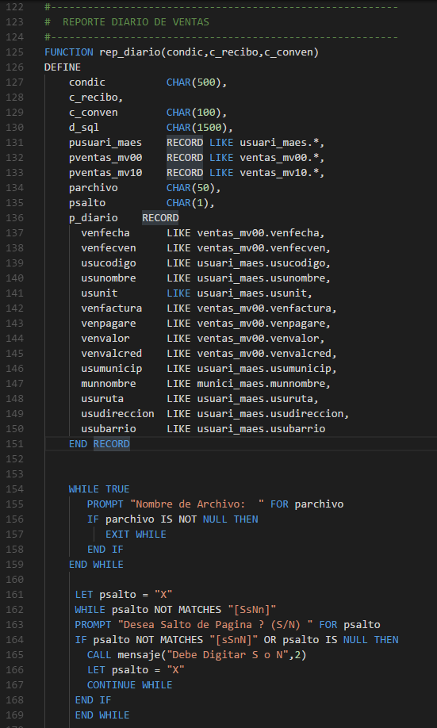

# Sintaxis Informix 4GL

Esta es la Sintaxis para usar Informix 4GL en Vs Code.

## Caracteristicas

Resaltado de sintaxis para Informix 4GL

Ejemplo de la Sintaxis:

> Resaltado Final.

## Requisitos

Actualmente no hay requisitos o dependencias, pero pienso integrar un gestor de FTP para trabajar directamente desde el servidor.

## problemas Conocidos

Los operadores no se resaltan.

## Notas de Lanzamiento

En proceso...

### 1.0.0

Primera version

-----------------------------------------------------------------------------------------------------------
